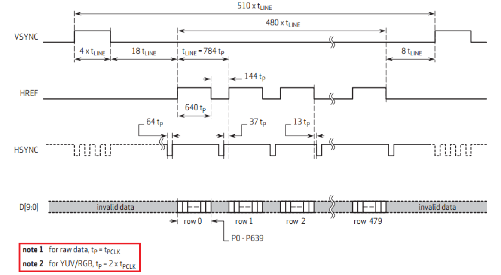
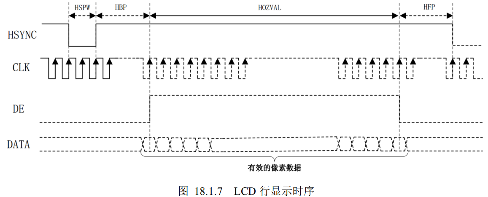
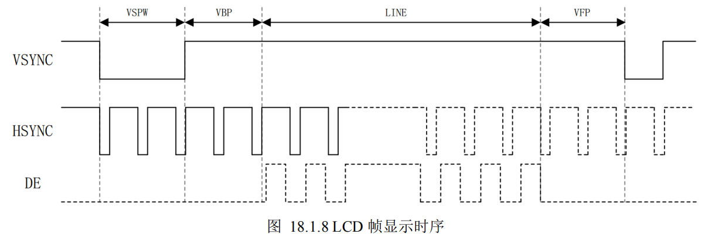

## ❥点击看I2C细节❥

1. 系统时钟为50MHz，i2c_clk是1MHz，i2c_dri里每4个i2c_clk周期sda改变一次，scl周期为250MHz
   
2. I2C在本工程中作用为初始化摄像头寄存器配置，并不承担数据的读（记得删除read，把800行代码缩减）
   
3. i2c_exec判定条件中有i2c_done，i2c_dri工作时i2c_exec竟然是0。所以i2c_cfg模块并非1μs给16位数据，而是每1μs查询i2c_done是否拉高
  
4. 以上都是骗人的

## ❥摄像头采集数据细节❥

1. 输入是摄像头的时钟，提供的信号为：cam_pclk,cam_vsync,cam_href,cam_data.

2. capture模块是通过byte_flag的翻转将两个8bit数据拼接成一个16bit数据。因为使用了D触发器拼接数据，所以byte_flag需要在打一拍。

3. tailor模块是将在lcd分辨率小于摄像头分辨率的情况时，只取摄像头中心一块放入lcd屏中。如果lcd分辨率更大就顺从摄像头的分辨率。

4. 行同步信号hsync为低时行同步信号宽度，表示一行的开始；之后拉高经过行显示后沿的时间，href拉高，表示着连续输入640tp的数据（一个tp表示两个八位数据）；再经过显示前延的时间再次拉低，代表下一个行的开始。这一个周期的时间叫做tLINE。
帧同步信号vsync先拉高，代表着帧同步信号宽度，表示一帧的开始；之后拉低经过帧显示后沿的时间，连续传输480个tLINE；再经过帧显示前延，再次拉高表示进入下一帧图像。

## ❥lcd显示细节❥

1.行同步信号HYSNC拉低，表示一行的开始；之后拉高经过一个行显示后延，使能DE拉高，开始传一行数据（水平分辨率个tp）；再经过显示前延的时间再次拉低，代表下一个行的开始。这一个周期的时间叫做tLINE。

帧同步信号VSYNC拉低，表示一帧的开始；之后拉低经过一个帧显示后沿后开始传输数据（垂直分辨率个tLINE）；再经过显示前沿，再次拉低表示进入下一帧图像。

2.lcd小，每个点都请求；lcd大，中间才请求。中间指的是在使能信号拉高期间无论是黑的还是摄像头都会传输数据，只有当传输到摄像头提供的数据的时候讲req信号拉高。

# Click to see I2C details Perso

1. The system clock is 50MHz, the i2c_clk is 1 MHZ, the sda of the i2c_dri is changed once every four i2c_clk periods, and the scl period is 250MHz

2. The function of I2C in this project is to initialize the configuration of camera registers, and it does not undertake data reading (remember to delete read and reduce 800 lines of code).

3. If i2c_done is included in the i2c_exec criteria, the value of i2c_exec is 0 when i2c_dri is working. Therefore, the i2c_cfg module does not give 1μs to 16 bits of data, but queries whether the i2c_done is higher every 1μs

4. The above are all lies

